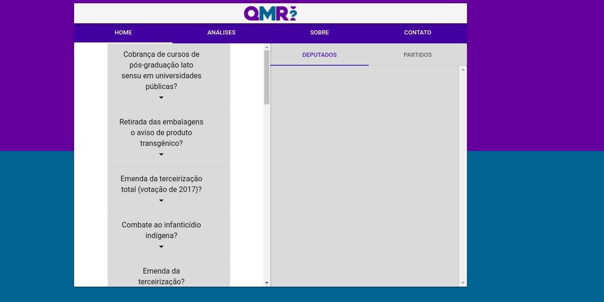
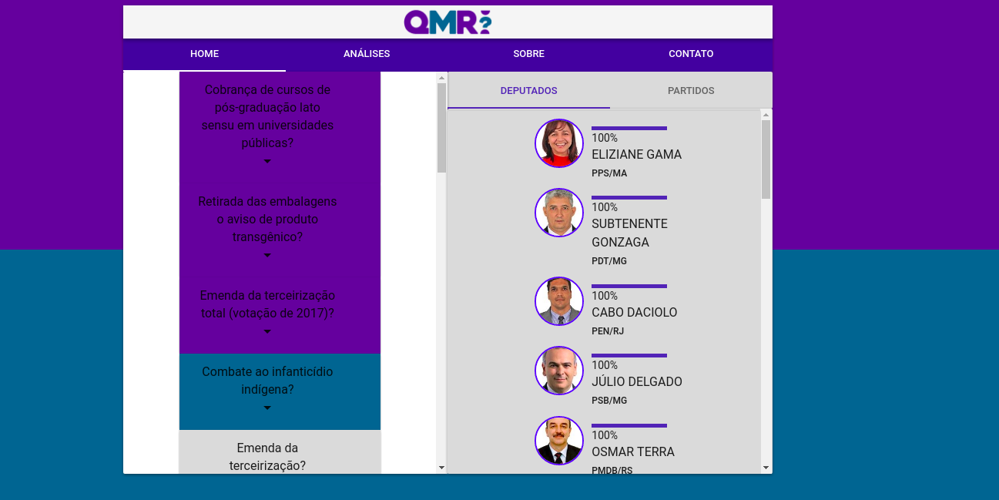
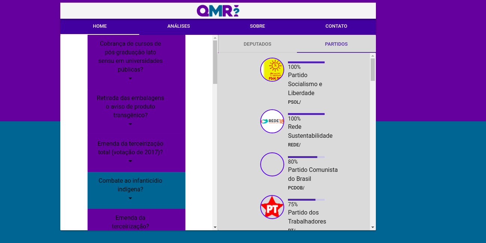
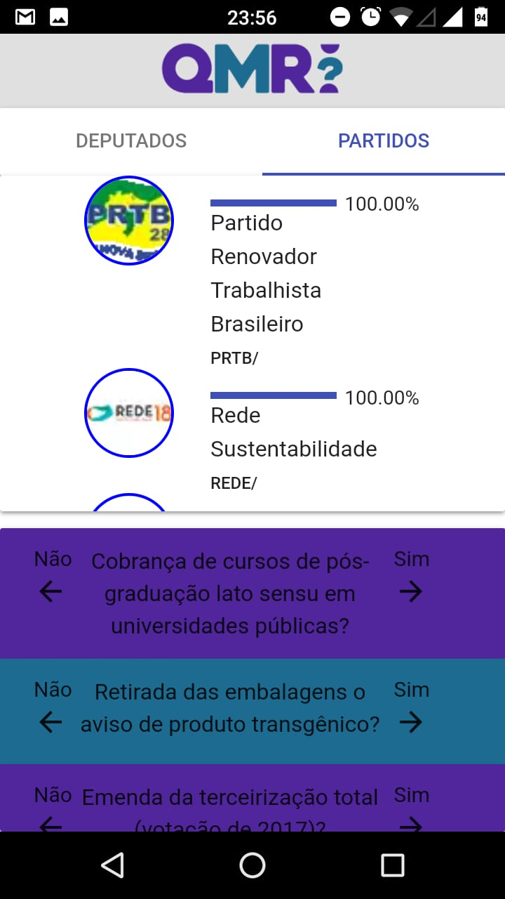
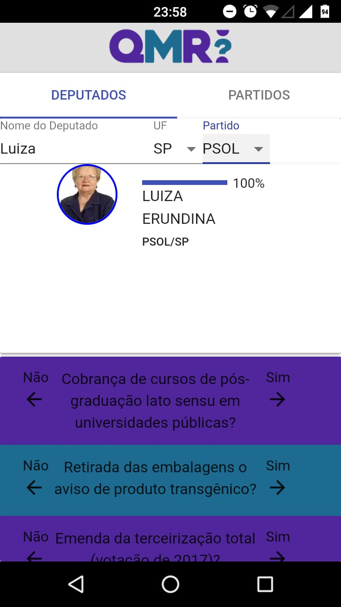

[](https://travis-ci.org/paul0vinicius/qmrepresenta-reactjs)

Disponível no [Heroku](https://qmrepresenta-2.herokuapp.com/).
Caso o site acima esteja fora do ar, tente o [GitHub Pages](https://paul0vinicius.github.io/qmrepresenta-reactjs/).

Esse projeto idealiza uma versão repaginada para o site [Quem me Representa?](http://qmrepresenta.com.br/), criado no terceiro hackfest do Laboratório Analytics (UFCG). O site calcula a compatibilidade entre o usuário e os deputados do câmara de acordo com determinadas votações.

O projeto está sendo desenvolvido utilizando [Create React App](https://github.com/facebookincubator/create-react-app) e [Material UI](https://material-ui-next.com/). Para mais informações de como realizar tarefas comuns utilizando o **Create React App**, visite esse [guia](https://github.com/facebookincubator/create-react-app/blob/master/packages/react-scripts/template/README.md).

Para rodar:

```
npm install
npm start
```

Após a instalação e inicialização, o browser abrirá automaticamente. O endereço de acesso é o [localhost:3000](localhost:3000).

### Screenshots

#### Desktop

Layout inicial


Após algumas votações na seção de deputados


Após algumas votações na seção de partidos


#### Mobile





